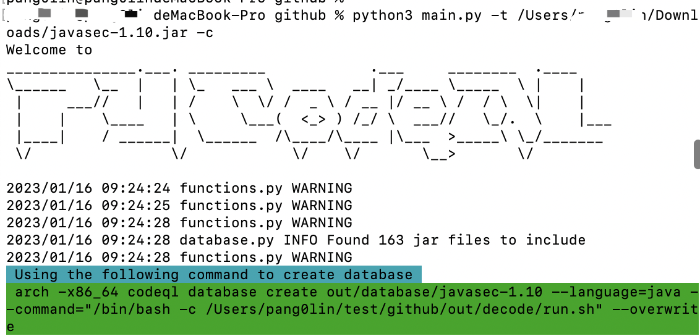
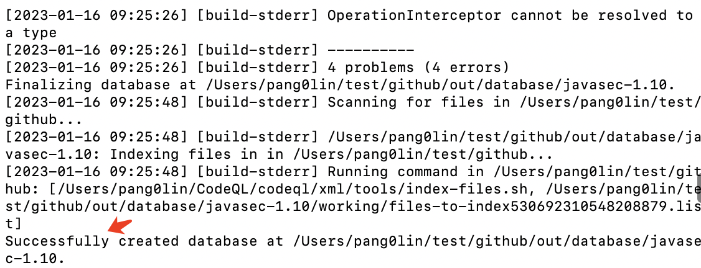
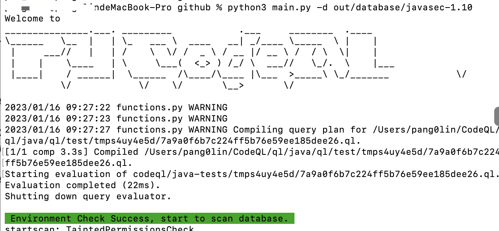
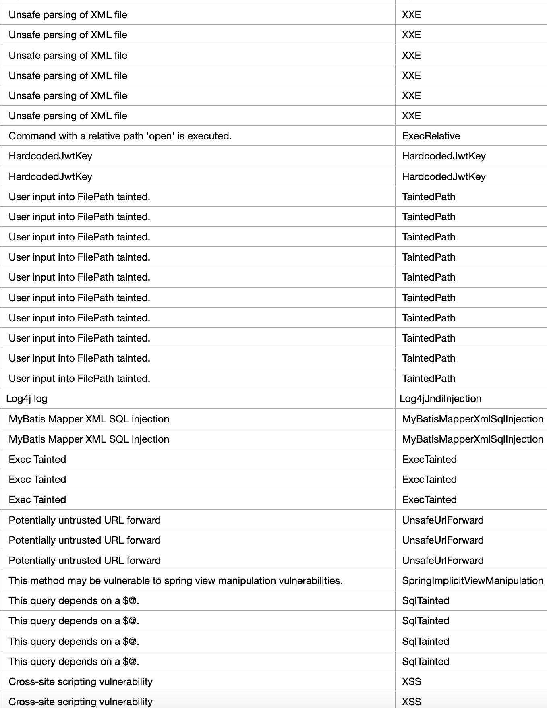

## 案例一

javasec是一款常见java漏洞靶场环境，类似于php的dvwa，项目[地址](https://github.com/j3ers3/Hello-Java-Sec)。

Step1, 初始化数据库，这里是直接对项目打包的SpringBoot的jar包进行扫描，使用下面的命令。其中-c参数代码源码是属于编译后源码，不能省略。

`python3 main.py -t /Users/xxx/Downloads/javasec-1.10.jar -c`

Step2, 生成数据库，如果有错请忽略，最终只要看到“Successfully created database” 就可以

`arch -x86_64 codeql database create out/database/javasec-1.10 --language=java --command="/bin/bash -c /Users/pang0lin/test/github/out/decode/run.sh" --overwrite`

Step3, 查询漏洞

`python3 main.py -d out/database/javasec-1.10`

最终的会生成[结果csv文件](2023-01-16_1673832447.csv)，暂未对结果进行分析

