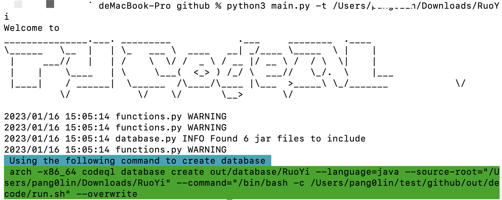
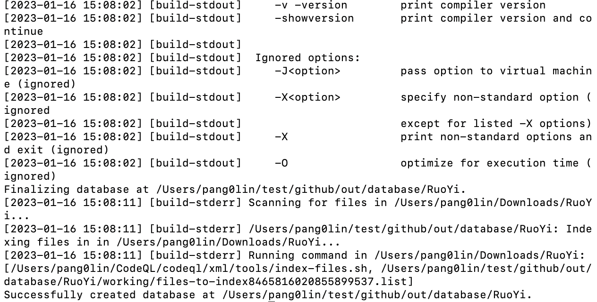
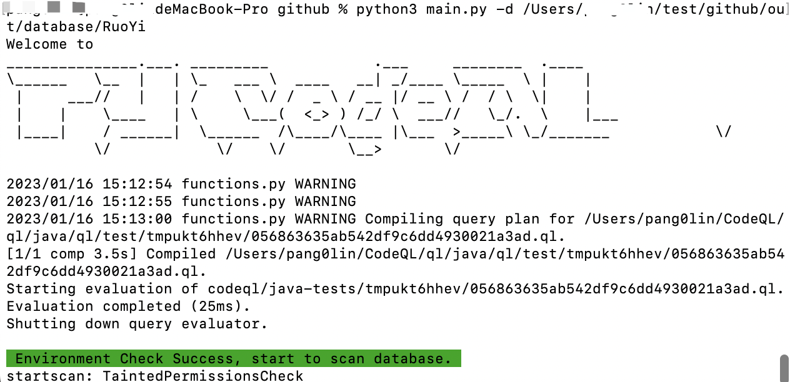
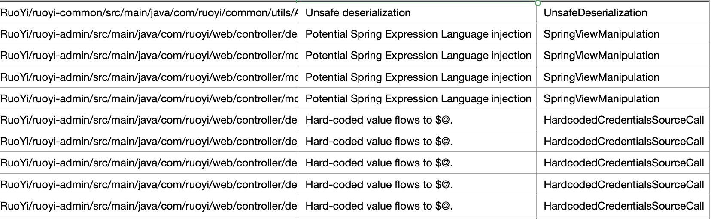

若依RuoYi是一款基于SpringBoot开发的轻量级Java快速开发框架，在国内拥有较高的使用量。

Step1, 初始化数据库，这里直接通过源码来生成数据库，所以不需要-c参数。

`python3 main.py -t /Users/xxx/Downloads/RuoYi`

Step2, 生成数据库，如果有错请忽略，最终只要看到“Successfully created database” 就可以

`arch -x86_64 codeql database create out/database/RuoYi --language=java --source-root="/Users/xxx/Downloads/RuoYi" --command="/bin/bash -c /Users/xxx/test/github/out/decode/run.sh" --overwrite`

Step3, 查询漏洞

`python3 main.py -d /Users/xxx/test/github/out/database/RuoY`

最终的会生成[结果csv文件](2023-01-16_1673853180.csv)，暂未对结果进行分析

