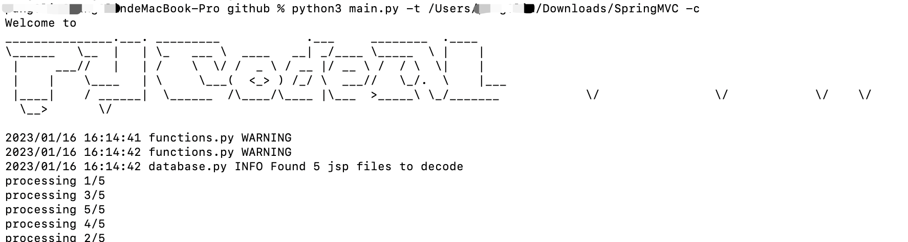
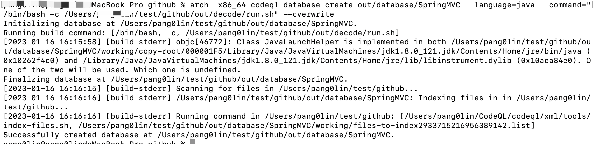
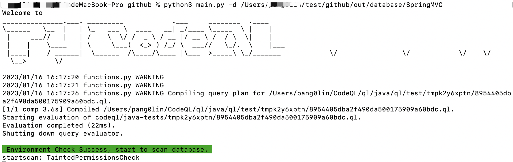
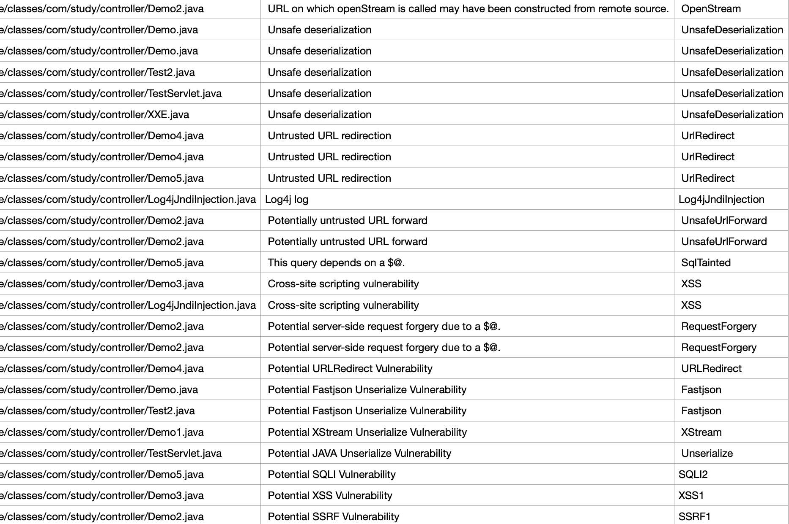

## 案例三

SpringMVC是一个测试的Spring项目。

Step1, 初始化数据库，通过源码目录方式来创建数据库，源码属于编译后的源码，需要-c参数。

`python3 main.py -t /Users/xxx/Downloads/javasec-1.10.jar -c`

Step2, 生成数据库，如果有错请忽略，最终只要看到“Successfully created database” 就可以

`arch -x86_64 codeql database create out/database/SpringMVC --language=java --command="/bin/bash -c /Users/xxx/test/github/out/decode/run.sh" --overwrite`

Step3, 查询漏洞

`python3 main.py -d /Users/pang0lin/test/github/out/database/SpringMVC`

最终的会生成[结果csv文件](2023-01-16_1673857046)，暂未对结果进行分析

